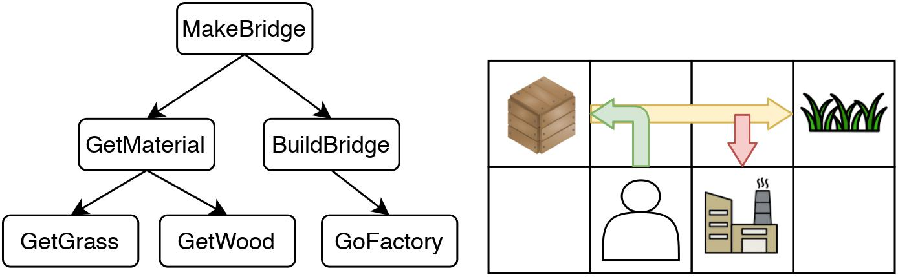
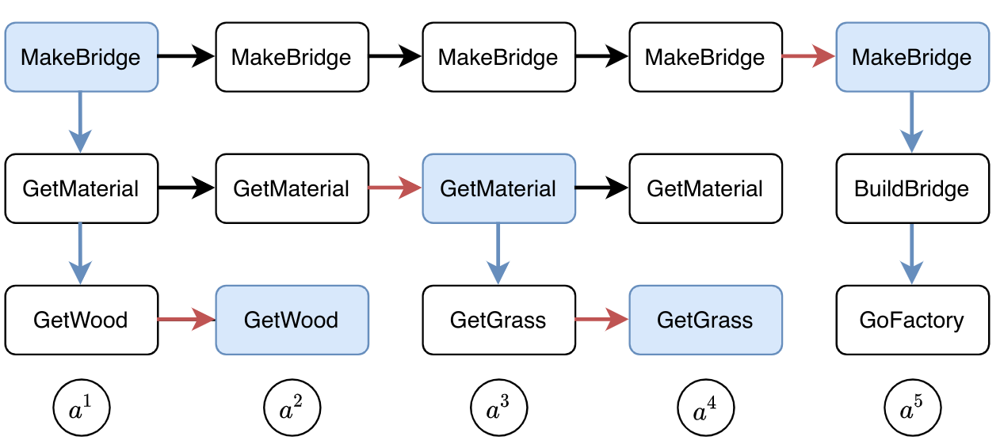
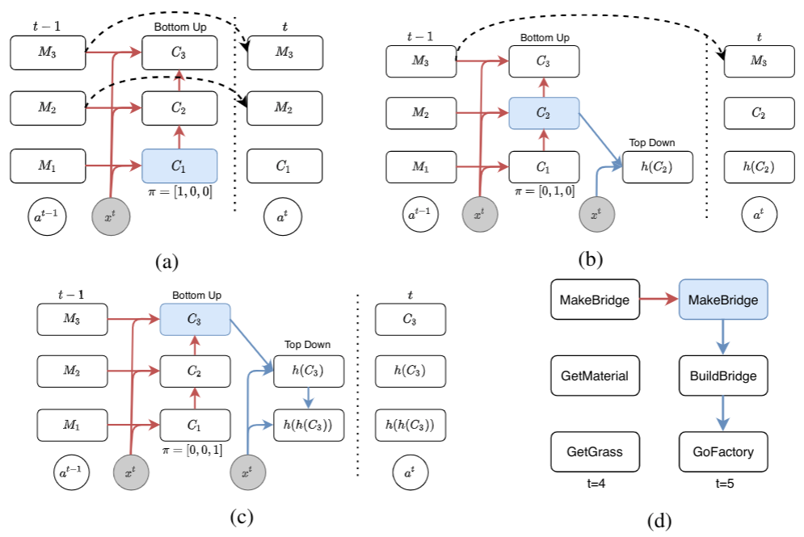
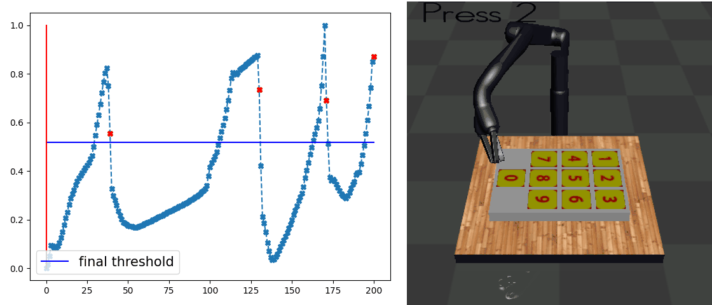
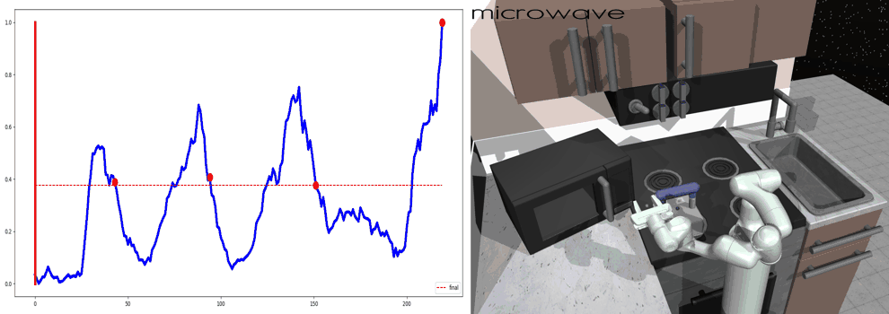

# Motivation

We aim to design a general policy network architecture so that it has a inductive bias to converge into the following subtask hierarchy as below. 
The agent wants to complete the task of building a bridge. 
This task can be decomposed into a tree-like, multi-level structure, where the root task is divided into `GetMaterial` and `BuildBridge`. 
`GetMaterial` can be further divided into `GetGrass` and `GetWood`. 

This is a sketch on how this subtask structure should be represented inside the agent’s memory during each time step. 
The memory would be divided into different levels, corresponding to the subtask structure. 
The *vertical expansion*  corresponds to planning or calling the next level subtasks.
The *horizontal expansion*  can be thought of as an internal update for eachsubtask.
The black arrows are copy operations.

# Method: **O**rdered **M**emory **P**olicy **N**etwork (**OMPN**)

We achieve the goal described above with a fully end-to-end network. 
We use a multi-level memory slots where each slot represent one subtask.
The central concept in our model is **expansion position** from which the vertical expansion is performed. 

1.  **if the model thinks the current lower-level subtask is ended, then the expansion position should be high (c) so that the higher-level subtask is vertically expanded into a new lower-level subtask.**

2. **if the model thinks the current lower-level subtask is not ended, then the expansion position should remain low (a) so that the higher-level subtask is copied to achieve long-term dependency.**. 

The details of our design can be found in the paper.

# Task Decomposition with Behavior Cloning

Our main result is that by simply using behavior cloning on the demonstration dataset, the ground truth subtask structure would *naturally emerge* inside our model, which can be found by monitoring the expansion positions. In the following visualization, we plot the trajectories as well as the change of expansion positon over time.

## Demo (Craft)

## Demo (Dial)

## Demo (Kitchen)

